# Samarbejd på Github med Souretree

### Git kommadoer

Reposits er hvor filer gemmes. Der er to den ene lokal (altså på din computer) den er afbilledet under BRANCES, den anden på Github kaldet Origin. Den findes under REMOTES.

Alle de versioner du ser som punkter på tidslijen findes lokalt på din computer. Hvis du vil skifye til dem kan du Checkout dem. Det sker også når man dobbelt klikker.

### Konflikter

Se på figuren nedenfor: Øverst er en grå ring med __Uncommited changes__ og neden under en rød gren udfra den røde ring. Den røde ring er mærket 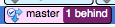, det er sidste gang jeg Push til Remote. Jeg har altså arbejdet på nogle filer siden jeg comittede og pushed sidts. Den blå ring er mærket med 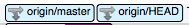, det viser at der er nogel andre der har arbjdet og comtited fil ændringer der er pushed til orgin. Det kan også ses på 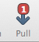 der viser at der er 1 commit på remote der mangler at blive henttet. Vi har defor muligvis en konflikt, hvis vi har arbejdet på de samme filer.

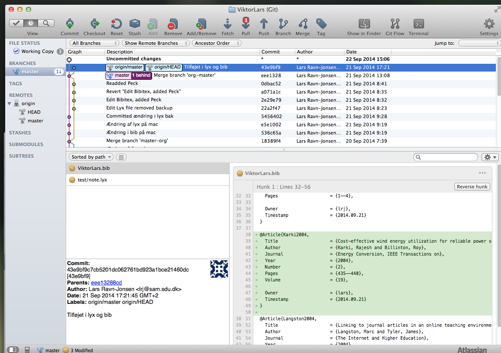

Hvis der er en konflikt vil vi have kontrol på hvordan de håndteres, derfor startes med at comitte de uncommited changes vi har, De skal _ikke_ pushes med det samme. Jeg har lavet commits ad to omgange.

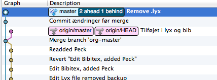

Vi er bu klar til merge, Højre klik på det rød område og vælg __Merge...__  

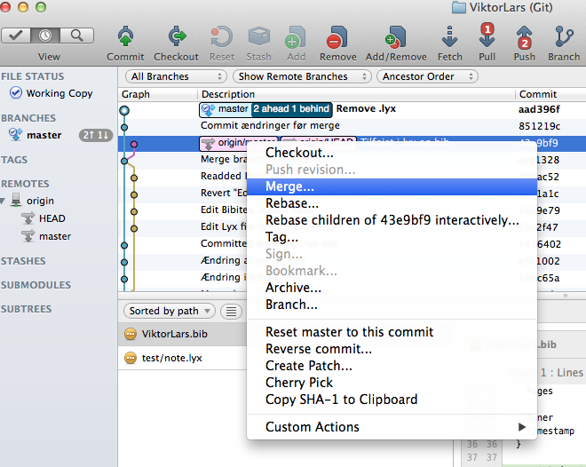

Man bekræfter at merge changes med det samme

Og man får en ny ucommited changes der samler de to grene. I dette tilfælde gøres vi opmærksom på at der er konflikter der skal løses.

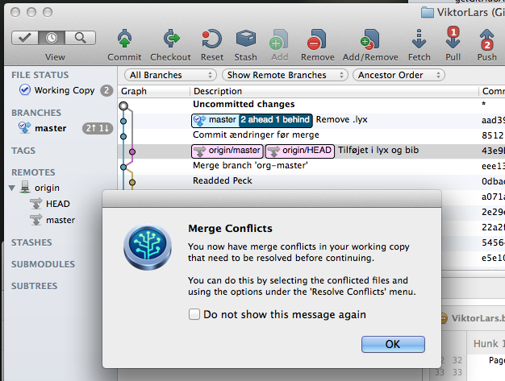

 Hvis vi klikker på den øverste ser vi at det er lyx filen der har konflikt:

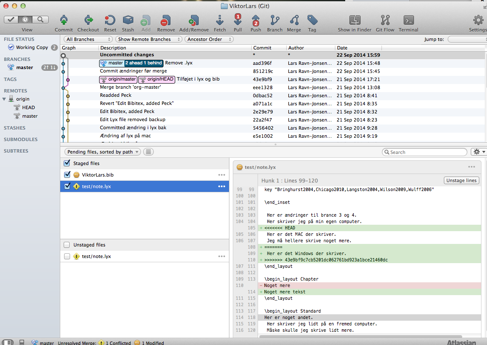

Højreklik på filen og vælg Rsolve conflics > Launce External Merge Tool

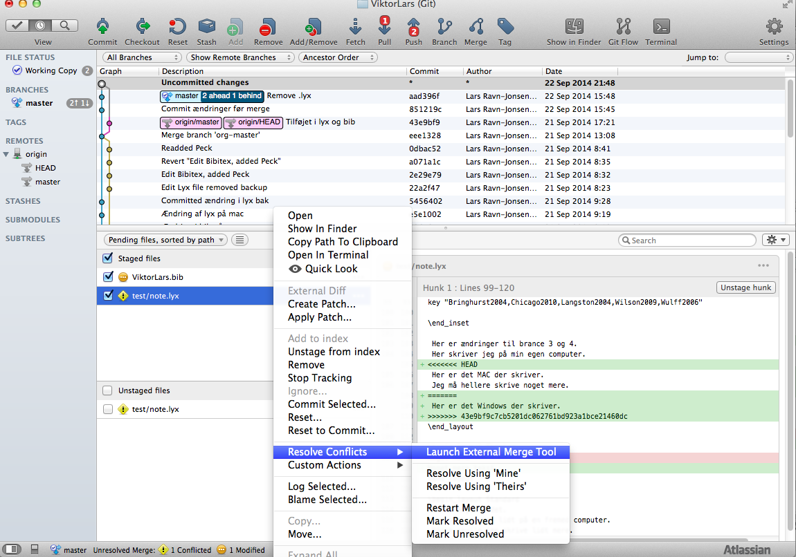

I extenal merge tool åbnes de to filer og man kan vælge hvad der skal med. Gem den mereged file og luk den External Merge Tool

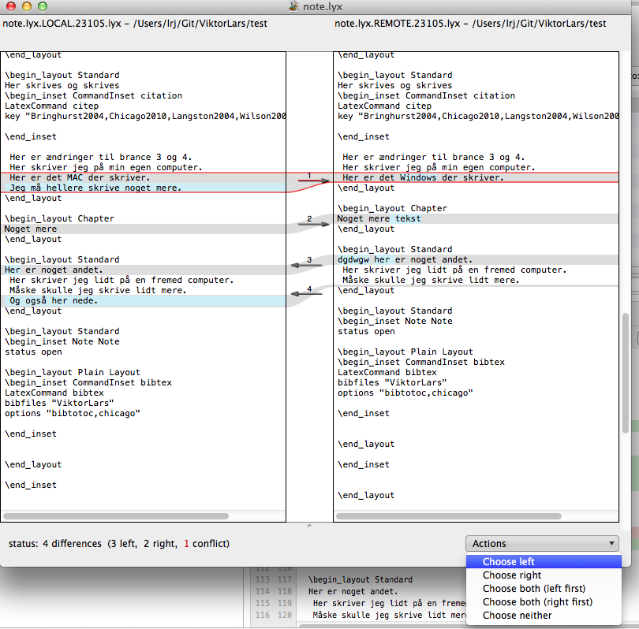

Nu er konflikterne løst og vi kan comite. Bemærk den orginale merged lyx file er gemt og kan slettes

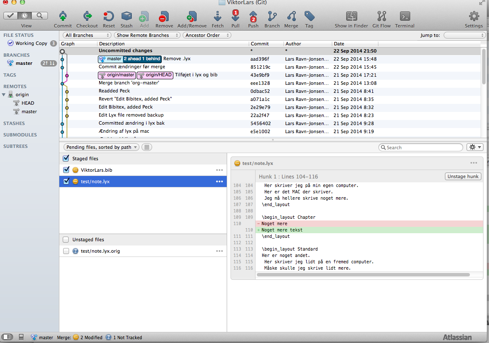

Tjek nu at lyx filen er som det ønskes. Hvis den ikke er det kan man checout tidligere versioner, gennem dem under nye navne og sammeligne med lyx Tools > compare

