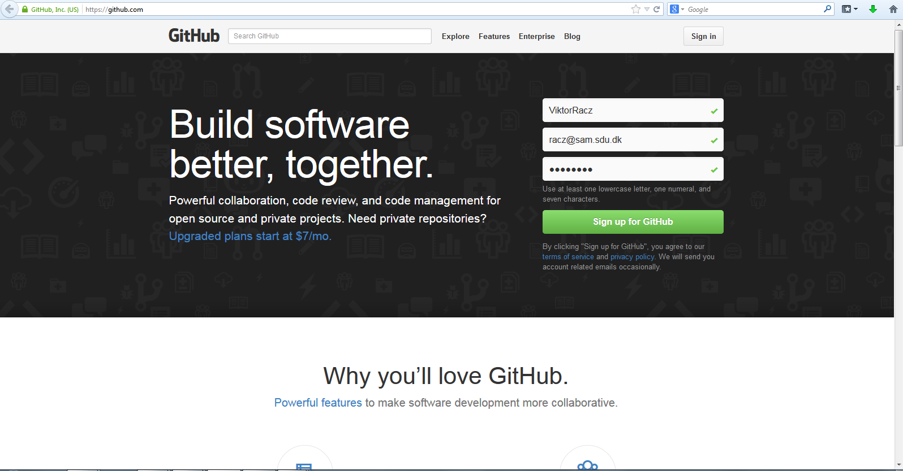
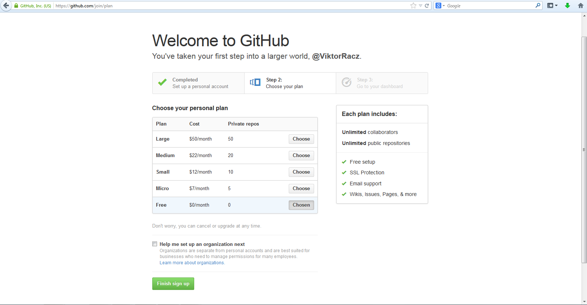
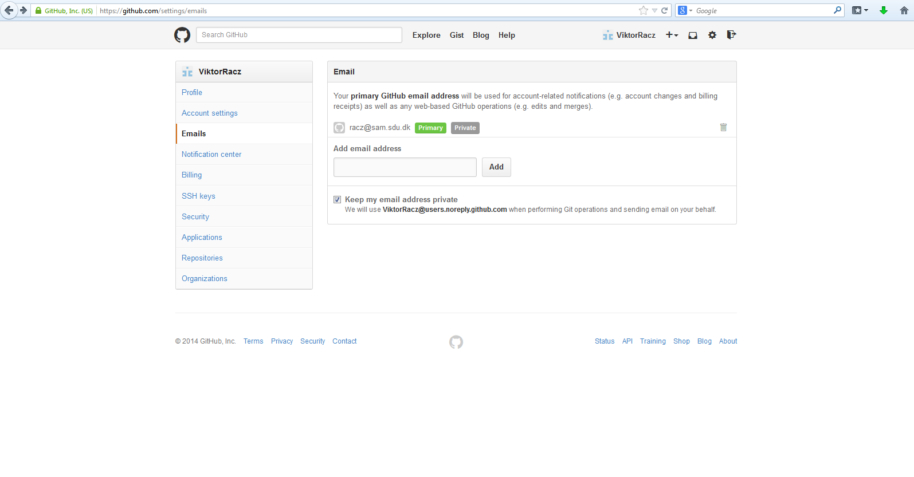

# Lav en GitHub account

[GitHub](githu.com) er et sted hvor man kan sammenarbejde og del arbejde - ofte programkoder - men alt kan deles, (se fx [HeinrichHartmann/doc](https://github.com/HeinrichHartmann/doc) eller [https://github.com/dhlorenz/openu-thesis-template](dhlorenz/openu-thesis-template)). Gratis kontoer er offentlige, dvs alle kan se det der er og må kopiere det. Man kan også få private kontoer, men så skal man normalt betale. Jeg har en organisations konto på [GitHub](githu.com) der hedder [EnvironmentalAndResource](https://github.com/EnvironmentalAndResource). Her kan jeg tildele private repositories til mine studerende, og det vil jeg godt bruge til at grupperne kan dele projekt dokumenter. For at kunne det skal I først lave en [GitHub](githu.com) konto.

Gå til [GitHub](https://github.com) og klik på sign up for GitHub lav et Username og skriv din email adresse og vælg et password og tryk 'Sign up for GitHub'

Der vil blive sendt en verifikation e-mail. Når du bruger den kommer du ind på denne side, vælg en Free account ($0/month)

Du vil nu få mulighed for at skjule din email adresse. Sørg for at der er flueben udfor 'Keep my email address privat'

Send dit GitHub username til mig så kan jeg får dig ind i organisationen og danne grupper.